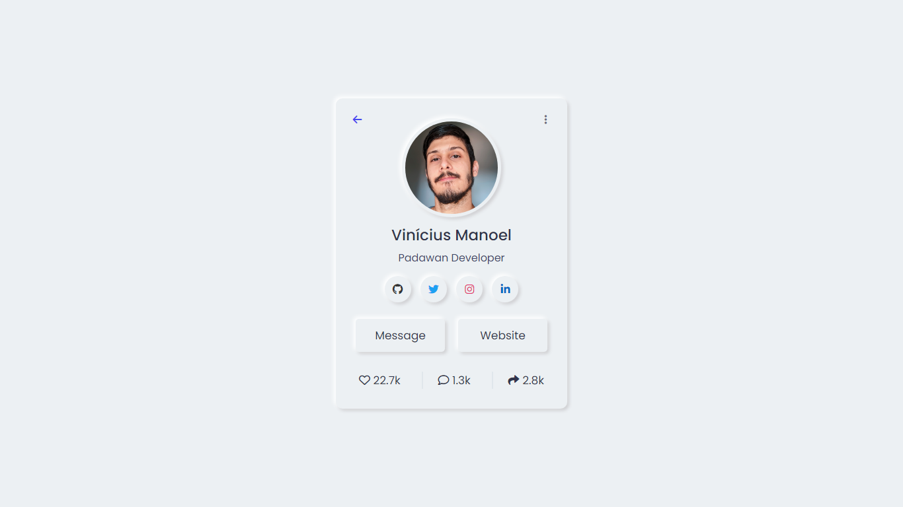

<h1 align="center">Profile Card</h1>



> Projeto finalizado.

[](https://developer.mozilla.org/en-US/docs/Web/HTML)
[](https://developer.mozilla.org/en-US/docs/Web/CSS)


## 💻 Acesse o Site

Antes de começar, verifique se você atendeu aos seguintes requisitos:

* Acesse o site que está na descrição do repositório, ou clique [aqui](https://vncsmnl.github.io/ProfileCard/)

## 💾 Clonando o Repositório

Certifique-se que você tem o [Git](https://git-scm.com/) instalado na sua máquina

```bash
git clone https://github.com/vncsmnl/ProfileCard.git
```


## 🤝 Colaboradores

Agradecemos às seguintes pessoas que contribuíram para este projeto:

<table>
  <tr>
    <td align="center">
      <a href="https://github.com/vncsmnl">
        <br>
        <sub>
          <b>Vinícius Manoel</b>
        </sub>
      </a>
    </td>
  </tr>
</table>

<a href="https://instagram.com/vncsmnl"></a> <a href="https://twitter.com/vncsmnl"></a>
<a href="https://br.linkedin.com/in/vncsmnl"></a>


## 📝 Licença

<a href="https://choosealicense.com/licenses/mit"></a>
